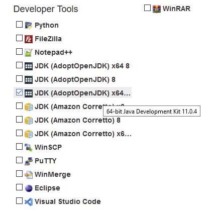
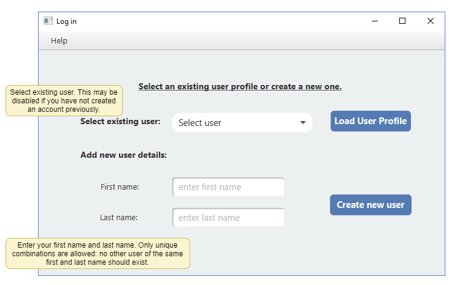
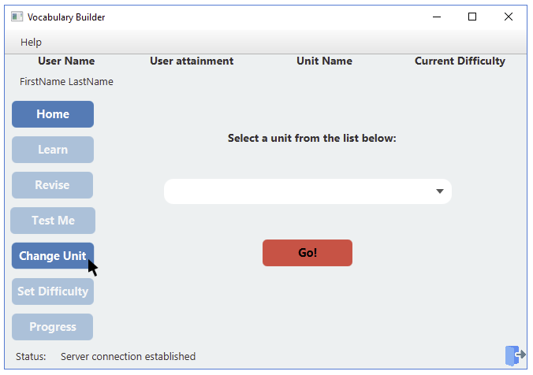

# Vocabulary-Builder
This repository contains information about the application, including the user manual and FAQs.

## Contents 
1. [Installation](https://github.com/myadav01/Vocabulary-Builder/blob/master/README.md#installation) 
2. Log in
3. Getting Started
4. FAQs
5. Contact Us

## English GSCE Vocabulary Builder Desktop Application

### Installation

Before running the application, please make sure that you have JDK 11 installed on your computer 
and that it is added to your class-path list in your Environment Variables. 
There are different ways to do this, but the following is recommended as it is easier and straightforward. 

1) Go to https://ninite.com/
2) Select JDK (AdoptOpenJDK) 64 bit 11.0.4 under 'Developer Tools': 

3) Press 'Get Your Ninite' at the bottom of the screen. 
4) Select 'Save file' when the downloader pop-up appears.
5) Run the file. Ninite will download and install the JDK for you.
6) To test that installation was successful, open 'Command Prompt' and enter 'java -version'. The following message should be displayed: 
````
openjdk version "11.0.4" 2019-07-16
OpenJDK Runtime Environment AdoptOpenJDK (build 11.0.4+11)
OpenJDK 64-Bit Server VM AdoptOpenJDK (build 11.0.4+11, mixed mode)
````

### Log in

The first screen when you open the application will always be the log in screen. Here, either create a new user 
account or choose an existing user account from the drop down menu: 


When creating your own user account, the following
criteria must be met: 

* The first name and last name combined should be unique. E.g. two 'John Smith's are not allowed, but a 'John Adams'
a 'John Smith' are fine.
* You must not enter a blank or a space as an entry. 

### Getting started

If you are logging in as a new user, you will need to select 'Change unit' on the navigation pane to select a unit to study:


Press 'Go' once you have made a selection. 

Your newly selected unit, along with your attainment and difficulty level in that unit should now appear in the top tool-bar. By default, the difficulty level 'easy' is assigned to your study session.

Once a unit has been selected, other activity buttons 'Learn', 'Revise', 'Test Me' should now be activated. 
Although you can choose any of the activities to begin with, we recommend performing them in order: Learn, Revise, Test Me. 

### FAQs

#### 1. How do I change difficulty? 

There are three difficulty levels: easy, medium and hard. By default, the first difficulty level assigned is 'easy'. To          change the difficulty level, you need to get an average score of 75% or more in Definitions and Usage tests. 

#### 2. How do the tests work? 

There are two types of tests: definitions and usage. Definitions tests are worth 30% of the overall score. Usage tests are worth 70% of the overall score.
You get a point for each correct answer. You lose a point for each wrong answer. The minimum you can score is 0 (no negative marks).

#### 3. How do I report a bug? 

The developers apologise for any hinderance to your learning experience. To report a bug, please write us an email on:
gcsevocabularybuilder@gmail.com
Please prefix the subject with 'BUG'. E.g. 'BUG: Application doesn't connect to server'. In the email, please include a description of the bug: what happens (or doesn't happen); which window is open; what triggers the bug, if known.

#### 4. How do I make recommendations or suggestions? 

We welcome any suggestions. Please email us on:
gcsevocabularybuilder@gmail.com, prefixing the subject with 'SUGGESTION'. E.g. 'SUGGESTION: Add xyz functionality'. In the email body, please include the description of the suggestion and why you think the application would benefit from the suggestion. 


### Contact Us 

You can reach us via the email (gcsevocabularybuilder@gmail.com). 
